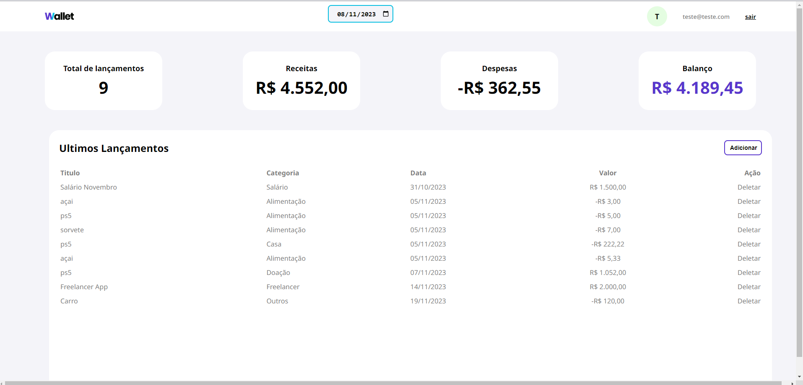

# Wallet App



## Introduction

This is an finances menagement dashboard using the JavaScript, HTML and CSS technologies

The main aim is the user add and delete your month finances datas:

- Name
- Value
- Date
- Category

The dashbord have 4 sections:

- Number of items
- Revenues (positive values)
- Expanses (negative values)
- Balance (Revanues + Expanses)

The data sources of this project is storage in API Wallet App

## Live Link

https://brjatoba92.github.io/wallet-app-frontend/


## Technologies used
- JavaScript
- HTML
- CSS

## Instruction to run locally

1. Clone the repo:
```
git clone git@github.com:brjatoba92/wallet-app-frontend.git
```

2. Navegate to the app folder

```
cd wallet-app-frontend
```

3. Open the `index.html` file

4. Use the `teste@teste.com` user or create new one


